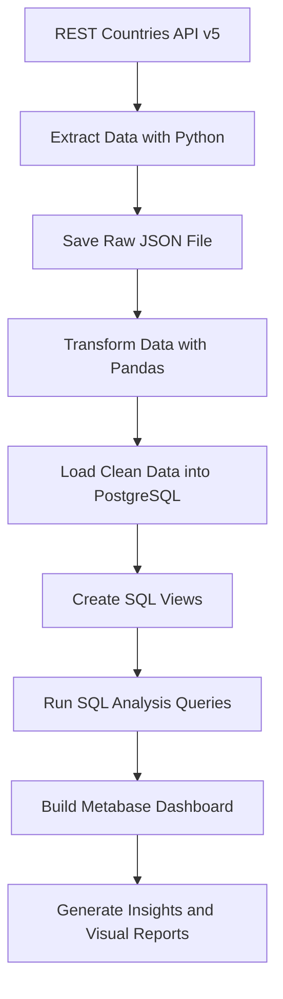
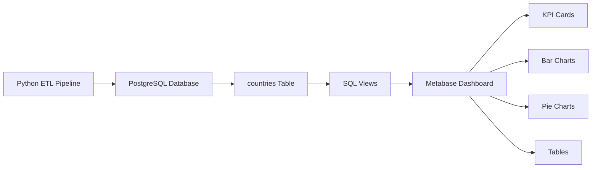
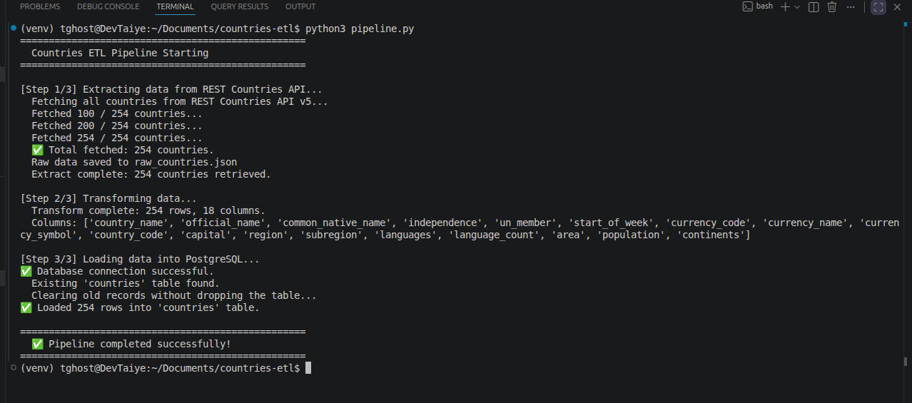
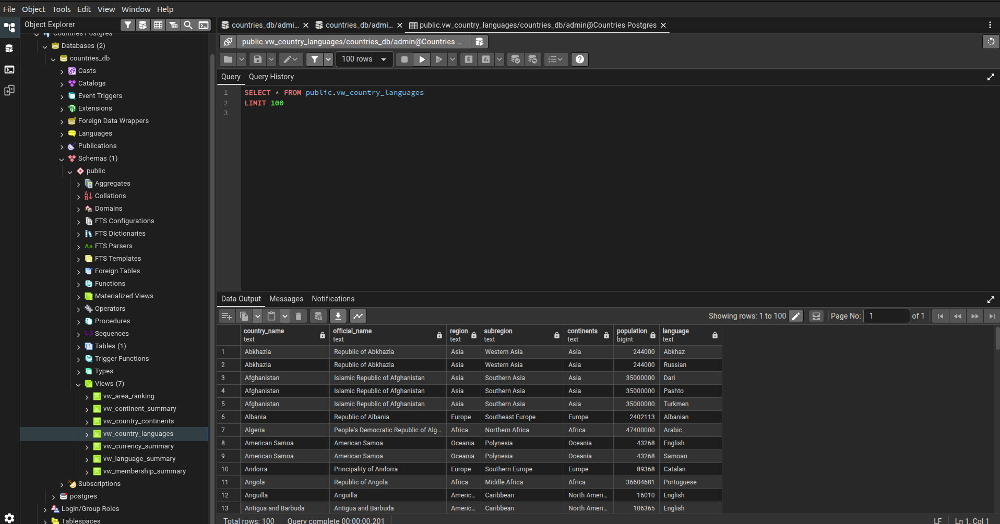
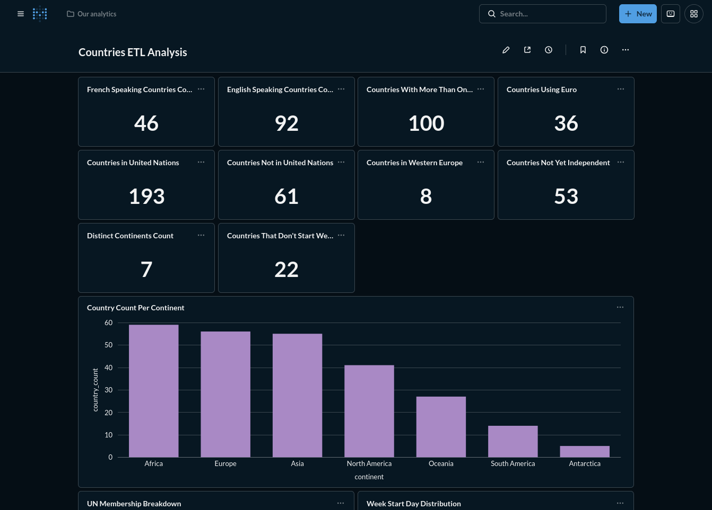
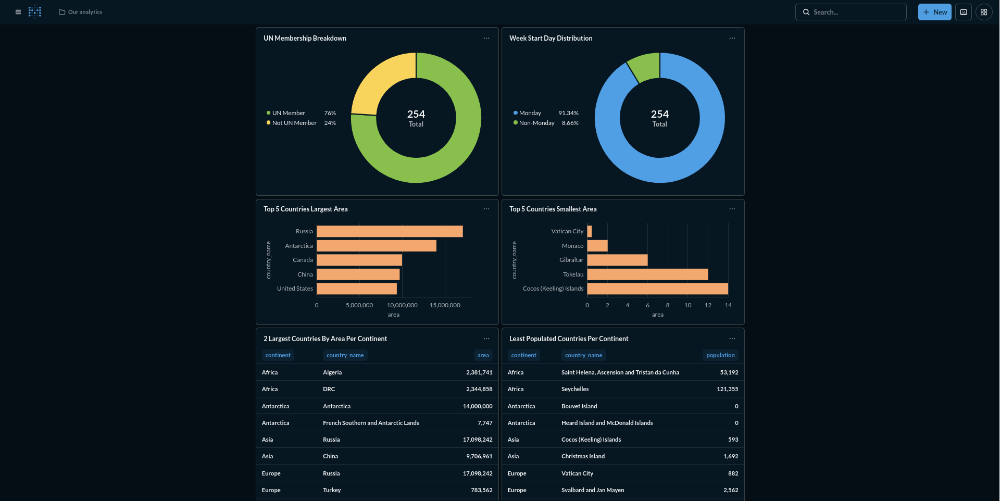

# 🌍 Countries ETL Pipeline

A end-to-end Data Engineering project that extracts world country data from the [REST Countries API v5](https://restcountries.com), transforms and cleans it using Python and Pandas, loads it into a PostgreSQL database, and visualizes insights using Metabase and Matplotlib.

---

## 📐 Architecture



> This is an **ETL pipeline** (not ELT) because data is transformed
> in Python **before** being loaded into PostgreSQL.

## 🔄 ETL Pipeline Explanation

### Why ETL and not ELT?

This project uses the **ETL** approach. The data is transformed
in Python using Pandas **before** being loaded into PostgreSQL.
This means the database only receives clean, structured data.

In an ELT approach, raw data would be loaded first and
transformed inside the database using SQL. ETL was chosen here
because the API returns deeply nested JSON that is easier to
flatten in Python than in SQL.

### 1. Extract

Connects to the REST Countries API v5 and retrieves all 254
countries in paginated batches of 100. Raw data is saved as
`raw_countries.json` for debugging purposes.

### 2. Transform

Nested JSON fields are flattened into a clean 18-column
DataFrame using Pandas. A `language_count` column is added
during transformation to enable reliable SQL filtering.

### 3. Load

The clean DataFrame is loaded into a PostgreSQL `countries`
table using SQLAlchemy and psycopg2.

### 4. Analyse and Visualize

Seven SQL views are created on top of the `countries` table.
These views power the Metabase dashboard and the SQL analysis
queries that answer all 14 project questions.

---

## 🗄️ Database and Dashboard Architecture



---

## 🗂️ Project Structure

```
countries-etl/
├── analysis/
│   └── country_insights.py     # Pandas analysis + Matplotlib charts
├── extract/
│   └── fetch_countries.py      # API extraction (paginated, v5)
├── load/
│   └── load_to_db.py           # SQLAlchemy PostgreSQL loader
├── outputs/                    # Auto-generated by country_insights.py
│   ├── continent_counts.csv
│   ├── country_insights_report.md
│   ├── countries_per_continent.png
│   ├── largest_area_by_continent.csv
│   ├── lowest_population_by_continent.csv
│   ├── top_5_largest_area.csv
│   ├── top_5_largest_area.png
│   ├── top_5_lowest_area.csv
│   └── top_5_lowest_area.png
├── screenshots/
│   ├── pipeline-success.png
│   ├── pgadmin-table-views.png
│   ├── metabase-dashboard-top.png
│   └── metabase-dashboard-bottom.png
├── sql/
│   ├── views.sql               # 7 PostgreSQL views for Metabase
│   └── analysis_queries.sql    # All 14 analytical questions answered
├── transform/
│   └── transform.py            # JSON flattening + data cleaning
├── .env.example                # Environment variable template
├── .gitignore
├── docker-compose.yml          # PostgreSQL + Metabase containers
├── pipeline.py                 # Orchestrates Extract → Transform → Load
├── README.md
└── requirements.txt
```

---

## 🛠️ Tech Stack

| Layer           | Tool                           |
| --------------- | ------------------------------ |
| Extraction      | Python `requests`              |
| Transformation  | Python `pandas`                |
| Loading         | `SQLAlchemy` + `psycopg2`      |
| Database        | PostgreSQL 15 (Docker)         |
| Visualization   | Metabase (Docker) + Matplotlib |
| Orchestration   | Python `pipeline.py`           |
| Environment     | Docker + Docker Compose        |
| Version Control | Git + GitHub                   |

---

## ⚙️ Setup & Installation

### Prerequisites

- Python 3.10+
- Docker + Docker Compose
- Git

### 1. Clone the repository

```bash
git clone https://github.com/your-username/countries-etl.git
cd countries-etl
```

### 2. Create and activate virtual environment

```bash
python3 -m venv venv
source venv/bin/activate
```

### 3. Install dependencies

```bash
pip install -r requirements.txt
```

### 4. Configure environment variables

```bash
cp .env.example .env
```

Edit `.env` with your values:

```env
DB_USERNAME=admin
DB_PASSWORD=your_password
DB_HOST=localhost
DB_PORT=5433
DB_NAME=countries_db
RESTCOUNTRIES_API_KEY=rc_live_demo
```

> The demo key `rc_live_demo` works immediately with no sign-up.
> For production use, register at [restcountries.com](https://restcountries.com/sign-up).

### 5. Start Docker containers

```bash
sudo docker compose up -d
```

This starts two containers:

- `countries_postgres` — PostgreSQL on port `5433`
- `countries_metabase` — Metabase dashboard on port `3000`

### 6. Run the ETL pipeline

```bash
python3 pipeline.py
```

Expected output:

```
==================================================
  Countries ETL Pipeline Starting
==================================================
[Step 1/3] Extracting data from REST Countries API...
  Fetched 100 / 254 countries...
  Fetched 200 / 254 countries...
  Fetched 254 / 254 countries...
  Extract complete: 254 countries retrieved.

[Step 2/3] Transforming data...
  Transform complete: 254 rows, 18 columns.

[Step 3/3] Loading data into PostgreSQL...
  ✅ Database connection successful.
  ✅ Loaded 254 rows into 'countries' table.

  ✅ Pipeline completed successfully!
==================================================
```

### 7. Create database views

```bash
sudo docker cp sql/views.sql countries_postgres:/tmp/views.sql
sudo docker exec -it countries_postgres psql -U admin -d countries_db -f /tmp/views.sql
```

### 8. Run analysis and generate charts

```bash
python3 analysis/country_insights.py
```

Outputs are saved to the `outputs/` folder.

### 9. Open Metabase dashboard

Navigate to [http://localhost:3000](http://localhost:3000)

On first launch, connect to PostgreSQL using:

- Host: `postgres`
- Port: `5432`
- Database: `countries_db`
- Username: `admin`
- Password: your password

> ⚠️ **Important:** When connecting Metabase to PostgreSQL,
> use `postgres` as the host (not `localhost`) and port `5432`
> (not `5433`). Metabase runs inside Docker and communicates
> with PostgreSQL using the internal Docker network.

---

## 📊 Data Fields Extracted

| Field                | Description                    |
| -------------------- | ------------------------------ |
| `country_name`       | Common country name            |
| `official_name`      | Official country name          |
| `common_native_name` | Native language name           |
| `independence`       | Whether country is independent |
| `un_member`          | UN membership status           |
| `start_of_week`      | First day of the week          |
| `currency_code`      | e.g. USD, EUR, NGN             |
| `currency_name`      | Full currency name             |
| `currency_symbol`    | e.g. $, €, ₦                   |
| `country_code`       | Calling code e.g. +234         |
| `capital`            | Capital city                   |
| `region`             | Geographic region              |
| `subregion`          | Geographic subregion           |
| `languages`          | Comma-separated languages      |
| `language_count`     | Number of official languages   |
| `area`               | Area in km²                    |
| `population`         | Total population               |
| `continents`         | Comma-separated continents     |

---

## ❓ Analysis Questions Answered

| #   | Question                                                  | Answer Location                 |
| --- | --------------------------------------------------------- | ------------------------------- |
| 1   | How many countries speak French?                          | `sql/analysis_queries.sql` → Q1 |
| 2   | How many countries speak English?                         | `sql/analysis_queries.sql` → Q2 |
| 3   | How many countries have more than 1 official language?    | Q3                              |
| 4   | How many countries use Euro?                              | Q4                              |
| 5   | How many countries are in Western Europe?                 | Q5                              |
| 6   | How many countries have not yet gained independence?      | Q6                              |
| 7   | How many distinct continents and countries per continent? | Q7a, Q7b                        |
| 8   | How many countries don't start the week on Monday?        | Q8                              |
| 9   | How many countries are not UN members?                    | Q9                              |
| 10  | How many countries are UN members?                        | Q10                             |
| 11  | Least 2 countries by population per continent?            | Q11                             |
| 12  | Top 2 countries by area per continent?                    | Q12                             |
| 13  | Top 5 countries with the largest area?                    | Q13                             |
| 14  | Top 5 countries with the smallest area?                   | Q14                             |

All queries are in `sql/analysis_queries.sql` and can be run directly in Metabase via **New → SQL Query**.

---

## 📸 Screenshots

### Pipeline Success



### pgAdmin — Table and Views



### Metabase Dashboard




---

## 📈 Key Results

| Question                                       | Result |
| ---------------------------------------------- | -----: |
| Countries that speak French                    |     46 |
| Countries that speak English                   |     92 |
| Countries with more than one official language |    100 |
| Countries whose official currency is Euro      |     36 |
| Countries in Western Europe                    |      8 |
| Countries that have not gained independence    |     53 |
| Distinct continents represented                |      7 |
| Countries whose week does not start on Monday  |     22 |
| Countries that are United Nations members      |    193 |
| Countries that are not United Nations members  |     61 |

## 📁 SQL Views Created

| View                    | Purpose                                              |
| ----------------------- | ---------------------------------------------------- |
| `vw_country_continents` | One row per country-continent pair                   |
| `vw_country_languages`  | One row per country-language pair                    |
| `vw_language_summary`   | Language flags per country                           |
| `vw_continent_summary`  | Aggregated continent statistics                      |
| `vw_currency_summary`   | Currency distribution                                |
| `vw_area_ranking`       | Area and population ranks globally and per continent |
| `vw_membership_summary` | UN membership and independence status                |

---

## 🔑 Environment Variables

| Variable                | Description                    |
| ----------------------- | ------------------------------ |
| `DB_USERNAME`           | PostgreSQL username            |
| `DB_PASSWORD`           | PostgreSQL password            |
| `DB_HOST`               | Database host (localhost)      |
| `DB_PORT`               | Mapped host port (5433)        |
| `DB_NAME`               | Database name                  |
| `RESTCOUNTRIES_API_KEY` | API key from restcountries.com |

---

## 📦 Requirements

```
requests
pandas
sqlalchemy
psycopg2-binary
python-dotenv
matplotlib
```

Install all with:

```bash
pip install -r requirements.txt
```
