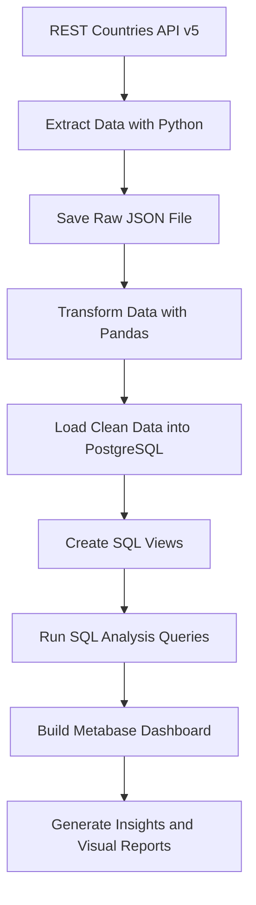
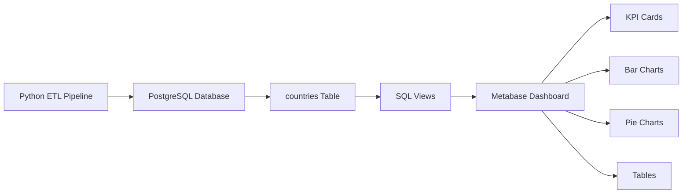

# 🌍 Countries ETL Pipeline

An end-to-end Data Engineering project that extracts world country data from the [REST Countries API v5](https://restcountries.com), transforms and cleans it using Python and Pandas, loads it into a PostgreSQL database, and visualizes insights using Metabase and Matplotlib.

---

## 📐 Architecture Flow



> This is an **ETL pipeline** (not ELT) because data is transformed in Python **before** being loaded into PostgreSQL.

---

## 🗄️ Database and Dashboard Architecture



---

## 📌 Project Overview

This project is a complete ETL data engineering pipeline that extracts country and territory data from the REST Countries API, transforms the raw JSON response into a structured tabular format, loads the cleaned data into PostgreSQL, and visualizes the final insights using Metabase.

It demonstrates how raw API data can be collected, cleaned, stored in a relational database, queried with SQL, and presented through an interactive analytics dashboard.

---

## 🎯 Project Objectives

The project was designed to answer the following analytical questions:

1. How many countries speak French?
2. How many countries speak English?
3. How many countries have more than one official language?
4. How many countries use Euro as their official currency?
5. How many countries are from Western Europe?
6. How many countries have not yet gained independence?
7. How many distinct continents are represented and how many countries are in each?
8. How many countries do not start the week on Monday?
9. How many countries are not United Nations members?
10. How many countries are United Nations members?
11. What are the least two populated countries for each continent?
12. What are the top two countries with the largest area for each continent?
13. What are the top five countries with the largest area?
14. What are the top five countries with the smallest area?

---

## 🔄 ETL Pipeline Explanation

### Why ETL and not ELT?

This project uses the **ETL** approach. The data is transformed in Python using Pandas **before** being loaded into PostgreSQL. This means the database only receives clean, structured data.

In an ELT approach, raw data would be loaded first and transformed inside the database using SQL. ETL was chosen here because the API returns deeply nested JSON that is easier to flatten in Python than in SQL.

### 1. Extract

Connects to the REST Countries API v5 and retrieves all 254 countries in paginated batches of 100. Raw data is saved as `raw_countries.json` for debugging purposes.

### 2. Transform

Nested JSON fields are flattened into a clean 18-column DataFrame using Pandas. A `language_count` column is added during transformation to enable reliable SQL filtering later.

### 3. Load

The clean DataFrame is loaded into a PostgreSQL `countries` table using SQLAlchemy and psycopg2.

### 4. Analyse and Visualize

Seven SQL views are created on top of the `countries` table. These views power the Metabase dashboard and the SQL analysis queries that answer all 14 project questions.

---

## 🗂️ Project Structure

```
countries-etl/
├── analysis/
│   └── country_insights.py       # Pandas analysis + Matplotlib charts
├── extract/
│   └── fetch_countries.py        # API extraction (paginated, v5)
├── load/
│   └── load_to_db.py             # SQLAlchemy PostgreSQL loader
├── outputs/                      # Auto-generated by country_insights.py
│   ├── continent_counts.csv
│   ├── country_insights_report.md
│   ├── countries_per_continent.png
│   ├── largest_area_by_continent.csv
│   ├── lowest_population_by_continent.csv
│   ├── top_5_largest_area.csv
│   ├── top_5_largest_area.png
│   ├── top_5_lowest_area.csv
│   └── top_5_lowest_area.png
├── screenshots/
│   ├── pipeline-success.png
│   ├── pgadmin-table-views.png
│   ├── metabase-dashboard-top.png
│   └── metabase-dashboard-bottom.png
├── sql/
│   ├── views.sql                  # 7 PostgreSQL views for Metabase
│   └── analysis_queries.sql       # All 14 analytical questions answered
├── transform/
│   └── transform.py               # JSON flattening + data cleaning
├── .env.example                   # Environment variable template
├── .gitignore
├── docker-compose.yml             # PostgreSQL + Metabase containers
├── pipeline.py                    # Orchestrates Extract → Transform → Load
├── README.md
└── requirements.txt
```

---

## 🛠️ Tech Stack

| Layer           | Tool                           |
| --------------- | ------------------------------ |
| Extraction      | Python `requests`              |
| Transformation  | Python `pandas`                |
| Loading         | `SQLAlchemy` + `psycopg2`      |
| Database        | PostgreSQL 15 (Docker)         |
| Visualization   | Metabase (Docker) + Matplotlib |
| Orchestration   | Python `pipeline.py`           |
| Environment     | Docker + Docker Compose        |
| Version Control | Git + GitHub                   |

---

## ⚙️ Setup and Installation

### Prerequisites

- Python 3.10+
- Docker + Docker Compose
- Git

### 1. Clone the Repository

```bash
git clone https://github.com/your-username/countries-etl.git
cd countries-etl
```

### 2. Create and Activate Virtual Environment

```bash
python3 -m venv venv
source venv/bin/activate
```

### 3. Install Dependencies

```bash
pip install -r requirements.txt
```

### 4. Configure Environment Variables

```bash
cp .env.example .env
```

Edit `.env` with your values:

```env
DB_USERNAME=admin
DB_PASSWORD=your_password
DB_HOST=localhost
DB_PORT=5433
DB_NAME=countries_db
RESTCOUNTRIES_API_KEY=rc_live_demo
```

> The demo key `rc_live_demo` works immediately with no sign-up.
> For production use, register at [restcountries.com](https://restcountries.com/sign-up).

### 5. Start Docker Containers

```bash
sudo docker compose up -d
```

This starts two containers:

- `countries_postgres` — PostgreSQL on port `5433`
- `countries_metabase` — Metabase dashboard on port `3000`

Check that both are running:

```bash
sudo docker compose ps
```

Expected:

```
countries_postgres    running
countries_metabase    running
```

### 6. Run the ETL Pipeline

```bash
python3 pipeline.py
```

Expected output:

```
==================================================
  Countries ETL Pipeline Starting
==================================================
[Step 1/3] Extracting data from REST Countries API...
  Fetched 100 / 254 countries...
  Fetched 200 / 254 countries...
  Fetched 254 / 254 countries...
  Extract complete: 254 countries retrieved.

[Step 2/3] Transforming data...
  Transform complete: 254 rows, 18 columns.

[Step 3/3] Loading data into PostgreSQL...
  ✅ Database connection successful.
  ✅ Loaded 254 rows into 'countries' table.

  ✅ Pipeline completed successfully!
==================================================
```

### 7. Create Database Views

```bash
sudo docker cp sql/views.sql countries_postgres:/tmp/views.sql
sudo docker exec -it countries_postgres psql -U admin -d countries_db -f /tmp/views.sql
```

Confirm the views were created:

```bash
sudo docker exec -it countries_postgres psql -U admin -d countries_db -c "\dv"
```

Expected views:

```
vw_country_continents
vw_country_languages
vw_language_summary
vw_continent_summary
vw_currency_summary
vw_area_ranking
vw_membership_summary
```

### 8. Run Analysis and Generate Charts

```bash
python3 analysis/country_insights.py
```

Outputs are saved to the `outputs/` folder including CSV files, PNG charts, and a markdown report.

### 9. Open Metabase Dashboard

Navigate to [http://localhost:3000](http://localhost:3000)

On first launch, connect to PostgreSQL using:

| Field         | Value          |
| ------------- | -------------- |
| Host          | `postgres`     |
| Port          | `5432`         |
| Database name | `countries_db` |
| Username      | `admin`        |
| Password      | your password  |

> ⚠️ **Important:** Use `postgres` as the host (not `localhost`) and port `5432` (not `5433`).
> Metabase runs inside Docker and connects to PostgreSQL using the internal Docker network name.

To run analysis queries inside Metabase:

```
New → SQL Query → select countries_db → paste query → Run → Visualize → Save
```

---

## 📊 Data Fields Extracted

| Field                | Description                    |
| -------------------- | ------------------------------ |
| `country_name`       | Common country name            |
| `official_name`      | Official country name          |
| `common_native_name` | Native language name           |
| `independence`       | Whether country is independent |
| `un_member`          | UN membership status           |
| `start_of_week`      | First day of the week          |
| `currency_code`      | e.g. USD, EUR, NGN             |
| `currency_name`      | Full currency name             |
| `currency_symbol`    | e.g. $, €, ₦                   |
| `country_code`       | Calling code e.g. +234         |
| `capital`            | Capital city                   |
| `region`             | Geographic region              |
| `subregion`          | Geographic subregion           |
| `languages`          | Comma-separated languages      |
| `language_count`     | Number of official languages   |
| `area`               | Area in km²                    |
| `population`         | Total population               |
| `continents`         | Comma-separated continents     |

---

## ❓ Analysis Questions Answered

| #   | Question                                                  | Location                              |
| --- | --------------------------------------------------------- | ------------------------------------- |
| 1   | How many countries speak French?                          | `sql/analysis_queries.sql` → Q1       |
| 2   | How many countries speak English?                         | `sql/analysis_queries.sql` → Q2       |
| 3   | How many countries have more than 1 official language?    | `sql/analysis_queries.sql` → Q3       |
| 4   | How many countries use Euro?                              | `sql/analysis_queries.sql` → Q4       |
| 5   | How many countries are in Western Europe?                 | `sql/analysis_queries.sql` → Q5       |
| 6   | How many countries have not yet gained independence?      | `sql/analysis_queries.sql` → Q6       |
| 7   | How many distinct continents and countries per continent? | `sql/analysis_queries.sql` → Q7a, Q7b |
| 8   | How many countries don't start the week on Monday?        | `sql/analysis_queries.sql` → Q8       |
| 9   | How many countries are not UN members?                    | `sql/analysis_queries.sql` → Q9       |
| 10  | How many countries are UN members?                        | `sql/analysis_queries.sql` → Q10      |
| 11  | Least 2 countries by population per continent?            | `sql/analysis_queries.sql` → Q11      |
| 12  | Top 2 countries by area per continent?                    | `sql/analysis_queries.sql` → Q12      |
| 13  | Top 5 countries with the largest area?                    | `sql/analysis_queries.sql` → Q13      |
| 14  | Top 5 countries with the smallest area?                   | `sql/analysis_queries.sql` → Q14      |

All queries can be run directly in Metabase via **New → SQL Query**.

---

## 📈 Key Results

| Question                                       | Result |
| ---------------------------------------------- | -----: |
| Countries that speak French                    |     46 |
| Countries that speak English                   |     92 |
| Countries with more than one official language |    100 |
| Countries whose official currency is Euro      |     36 |
| Countries in Western Europe                    |      8 |
| Countries that have not gained independence    |     53 |
| Distinct continents represented                |      7 |
| Countries whose week does not start on Monday  |     22 |
| Countries that are United Nations members      |    193 |
| Countries that are not United Nations members  |     61 |

---

## 📊 Visualization Dashboard

The Metabase dashboard includes:

- KPI cards for language, currency, UN membership, independence, and week-start counts
- Bar chart showing country count per continent
- Pie chart showing UN membership breakdown
- Pie chart showing week-start day distribution
- Horizontal bar charts for top 5 largest and smallest countries by area
- Tables showing least populated countries per continent
- Tables showing largest countries by area per continent

---

## 📁 SQL Views Created

| View                    | Purpose                                                |
| ----------------------- | ------------------------------------------------------ |
| `vw_country_continents` | One row per country-continent pair                     |
| `vw_country_languages`  | One row per country-language pair                      |
| `vw_language_summary`   | Language flags per country (English, French, etc.)     |
| `vw_continent_summary`  | Aggregated continent statistics                        |
| `vw_currency_summary`   | Currency distribution across countries                 |
| `vw_area_ranking`       | Area and population ranks globally and per continent   |
| `vw_membership_summary` | UN membership, independence, and week-start categories |

---

## 📸 Screenshots

### Pipeline Execution


**Figure 1: Terminal output showing successful ETL pipeline execution.**

---

### PostgreSQL Database — Table and Views


**Figure 2: PostgreSQL countries table and analysis views shown in pgAdmin.**

---

### Metabase Dashboard


**Figure 3a: Top section of the Metabase dashboard showing KPI cards and summary charts.**


**Figure 3b: Bottom section of the Metabase dashboard showing area and population ranking visuals.**

---

## 🔑 Environment Variables

| Variable                | Description                    |
| ----------------------- | ------------------------------ |
| `DB_USERNAME`           | PostgreSQL username            |
| `DB_PASSWORD`           | PostgreSQL password            |
| `DB_HOST`               | Database host (`localhost`)    |
| `DB_PORT`               | Mapped host port (`5433`)      |
| `DB_NAME`               | Database name                  |
| `RESTCOUNTRIES_API_KEY` | API key from restcountries.com |

---

## 📦 Requirements

```
requests
pandas
sqlalchemy
psycopg2-binary
python-dotenv
matplotlib
```

Install all with:

```bash
pip install -r requirements.txt
```

---

## 💡 Why This Project Matters

This project demonstrates a real-world data engineering workflow:

- Extracting data from a live REST API with pagination handling
- Handling deeply nested JSON structures in Python
- Cleaning and structuring data with Pandas before loading
- Loading into a relational database with SQLAlchemy
- Writing analytical SQL using window functions and CTEs
- Creating reusable database views for clean reporting
- Building an interactive dashboard with Metabase
- Running a fully reproducible environment with Docker Compose
- Documenting the full pipeline clearly for a GitHub portfolio

---

## 👤 Author

**Taiye Suleiman**

- GitHub: https://github.com/tboy4all
- LinkedIn: https://www.linkedin.com/in/devtaiye/
